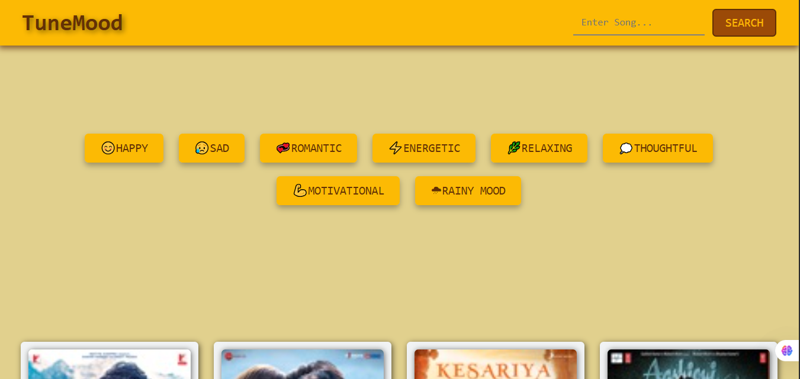
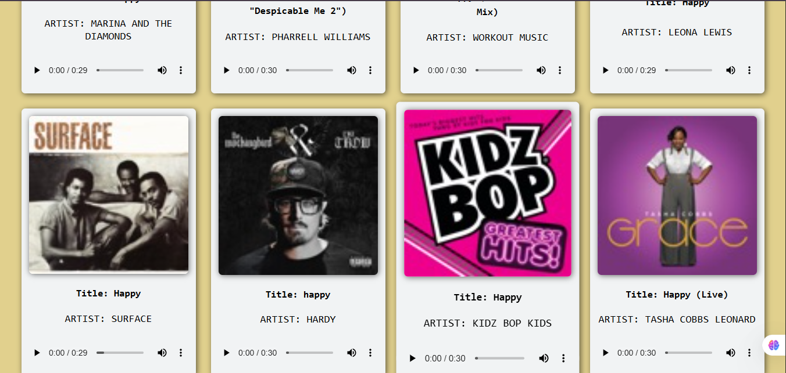

# 🎵 TuneMood — Mood-Based Music Player

**TuneMood** is a responsive web app that plays songs based on a user's selected mood or search query.  
Built from scratch using **HTML, CSS, and vanilla JavaScript**, the app fetches real music data from the **iTunes Search API** and displays results as interactive song cards with album art and a 30-second audio preview.

---

## 🧾 Features

* 🎧 **Mood-Based Search** – Click mood buttons (e.g., Happy, Sad, Energetic) to get a playlist matching that vibe.  
* 🔎 **Free-Text Search** – Search by song title, artist name, or any keyword using the search bar.  
* 🖼️ **Dynamic Song Cards** – Each result shows album artwork, song title, and artist name.  
* ⏯️ **Audio Previews** – Listen to a 30-second preview of each song directly on the card.  
* ▶️ **Single Active Audio** – When one song preview plays, any other playing audio automatically pauses.  
* 💬 **Loading & Error Messages** – Displays messages like “Loading...” or “No songs found” to keep the user informed.  
* 📱 **Responsive UI** – The layout adjusts smoothly for both mobile and desktop screens.

---

## 🔧 Tech Stack

* **HTML5** – Structure and markup of the web app.  
* **CSS3** – Styling, layout (Flexbox), and animations.  
* **JavaScript (Vanilla)** – Event handling, API fetching (`fetch`), and dynamic DOM updates.  
* **iTunes Search API** – Source of music metadata and 30-second preview clips.

---

## 🔍 How It Works

1. The user clicks a mood button (e.g., *Happy*) or types something like *Arijit Singh* in the search bar.  
2. JavaScript captures this input and builds a request URL for the **iTunes Search API**.  
3. The `fetch()` method retrieves the matching songs.  
4. The app dynamically creates song cards with image, title, artist, and audio preview.  
5. The user can play any preview — and other songs automatically pause.  

---

## 📥 Setup & Run Locally

You don’t need any special setup — just open it in your browser.

1. **Clone the repository:**
    ```bash
    git clone https://github.com/<your-username>/TuneMood-Project.git
    ```
2. **Navigate to the directory:**
    ```bash
    cd TuneMood-Project
    ```
3. **Run the app:**
    - Double-click `index.html` to open it in your browser.  
    - 💡 *Tip:* If using VS Code, run it with the **Live Server** extension (recommended for API requests).

---

## 📸 Preview

### 🎵 Main Interface  


### 🔍 Search Feature  


---

## 🔮 Future Improvements

* ❤️ **Save Favourites** – Allow users to like and store their favorite songs using `localStorage`.  
* 🌐 **More APIs** – Add support for Deezer or Spotify APIs for a larger song collection (with a backend proxy).  

---

## 🧾 License

This project is created and maintained by **Saurabh Patil**.  
You are free to **use, modify, or share** it for learning and portfolio purposes.  
If you publish or showcase it publicly, please give **proper credit** to the original author.

---

## ✉️ Contact / Author

**Saurabh Patil**  
💻 GitHub: [saurabhpatil67](https://github.com/saurabhpatil67)
